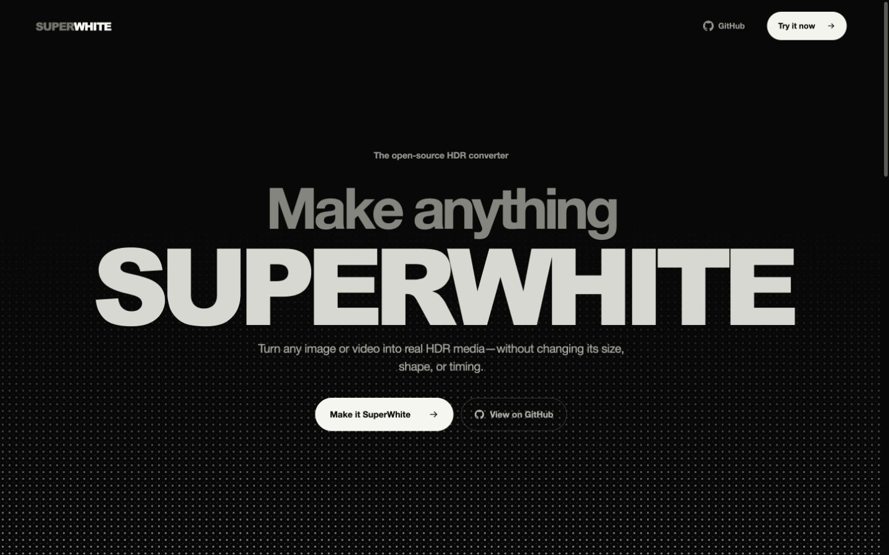
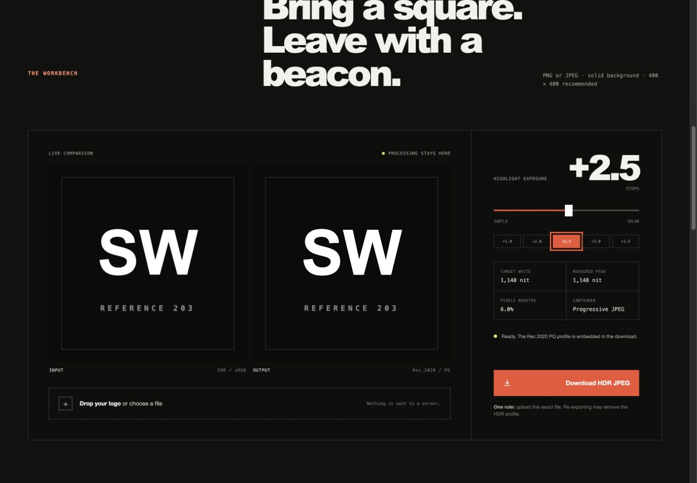

<p align="center">
  
</p>

<p align="center">
  <strong>Turn SDR images and videos into real Rec.2020/PQ HDR media.</strong><br>
  Keep the original size, shape, frame rate, duration, and timing.
</p>

<p align="center">
  <a href="https://arkane-o7.github.io/SuperWhite/"><strong>Open SuperWhite</strong></a>
  &nbsp;·&nbsp;
  <a href="#command-line">Command line</a>
  &nbsp;·&nbsp;
  <a href="#open-source">Open source</a>
</p>



SuperWhite selectively lifts bright SDR pixels into HDR headroom. It does not
fake the effect by resizing, cropping, padding, or stretching the source.

| Use it in | Best for | Processing |
|---|---|---|
| **Public website** | Images | Entirely inside the browser |
| **Local website** | Images and videos | Browser + FFmpeg on your machine |
| **Command line** | Repeatable image and video conversion | Python + FFmpeg on your machine |

## What ships today

- A browser image converter with a live SDR/HDR comparison and exposure control
- Dimension-preserving HDR JPEG output with a bundled Rec.2020/PQ ICC profile
- A local video workbench backed by native FFmpeg
- HDR10 MP4 output using 10-bit HEVC, Rec.2020 primaries, PQ, and HDR10 metadata
- Image and video CLI tools for repeatable conversions
- Automatic macOS, Windows, and Linux setup instructions on the website



## Use the website

Open **[SuperWhite]([https://superwhite.vercel.app/])**
and drop in an image. Choose an exposure from +1.0 to +3.9 stops, inspect the
result, and download the HDR JPEG.

Image conversion on the public website happens in the browser. The file is not
uploaded to a remote conversion service.

### Enable video in the same interface

The public GitHub Pages build cannot run native FFmpeg. Clone the project and
start the local runner to enable video conversion:

```bash
git clone https://github.com/Arkane-o7/SuperWhite.git
cd SuperWhite
npm install
python3 -m pip install -r requirements.txt
brew install ffmpeg
npm run local
```

Open [http://127.0.0.1:4173](http://127.0.0.1:4173). Uploaded videos travel
only from the browser to the FFmpeg process running on the same machine.

> The example above is for macOS. Use the platform-specific FFmpeg command in
> the next section on Windows or Linux. On Windows, replace `npm run local`
> with `npm run build` followed by `py scripts\superwhite_server.py`.

## Command line

SuperWhite is currently installed from source. It is not published as a
`pip install superwhite` package or a Homebrew formula.

<details open>
<summary><strong>macOS</strong></summary>

```bash
git clone https://github.com/Arkane-o7/SuperWhite.git
cd SuperWhite
python3 -m pip install -r requirements.txt
brew install ffmpeg
```

</details>

<details>
<summary><strong>Windows · PowerShell</strong></summary>

```powershell
git clone https://github.com/Arkane-o7/SuperWhite.git
Set-Location SuperWhite
py -m pip install -r requirements.txt
winget install --id Gyan.FFmpeg --exact
```

</details>

<details>
<summary><strong>Linux · Debian / Ubuntu</strong></summary>

```bash
sudo apt update
sudo apt install ffmpeg
git clone https://github.com/Arkane-o7/SuperWhite.git
cd SuperWhite
python3 -m pip install -r requirements.txt
```

Use your distribution's package manager instead of `apt` on other Linux
distributions.

</details>

### Convert an image

```bash
python3 scripts/make_hdr_image.py input.png output-hdr.jpg --stops 2.5
python3 scripts/inspect_hdr_image.py output-hdr.jpg
```

The image converter accepts formats Pillow can decode, preserves the source
dimensions and aspect ratio, flattens transparency onto near-black, converts
the image to Rec.2020, PQ-encodes it, and embeds the bundled delivery profile.

### Convert a video

```bash
python3 scripts/make_hdr_video.py input.mp4 output-hdr.mp4 --stops 2.5
```

Optional x265 controls:

```bash
python3 scripts/make_hdr_video.py input.mov output-hdr.mp4 \
  --stops 3.0 \
  --crf 18 \
  --preset medium
```

The video output keeps the source resolution, display aspect ratio, frame
rate, duration, and audio timing. It uses 10-bit HEVC Main 10 in an MP4
container with the `hvc1` compatibility tag and AAC audio.

Already-HDR PQ and HLG video inputs are rejected to prevent double conversion.
On Windows, replace `python3` with `py` in the commands above.

## Exposure

`--stops` controls the maximum highlight lift. It never changes the media's
geometry.

| Stops | Approximate target | Character |
|---:|---:|---|
| +1.0 | 406 nit | Restrained |
| +2.0 | 812 nit | Visible |
| +2.5 | 1,148 nit | Strong |
| +3.0 | 1,624 nit | Intense |
| +3.9 | 3,027 nit | Extreme |

The lift uses a smooth luminance threshold, leaving dark and midtone areas
close to the source while giving highlights access to HDR headroom.

## Compatibility

The visible result depends on the complete playback chain: the HDR file,
metadata surviving its destination, an HDR-aware player and operating system,
and an HDR-capable display. Some social platforms and image processors strip
or rewrite HDR metadata.

## Development

Requires Node.js 22.12+ and Python 3.

```bash
npm install
python3 -m pip install -r requirements.txt
npm test
python3 -m unittest discover -s tests
npm run build
```

- `npm run dev` starts the image-only Vite development server.
- `npm run local` builds the site and starts the FFmpeg-enabled local runner.

<details>
<summary><strong>Project layout</strong></summary>

```text
src/                          React interface and browser image converter
scripts/make_hdr_image.py     dimension-preserving HDR still converter
scripts/make_hdr_video.py     dimension-preserving HDR10 video converter
scripts/superwhite_server.py  local upload UI and FFmpeg bridge
public/rec2020pq.icc          bundled Rec.2020/PQ delivery profile
tests/                        image and video conversion checks
```

</details>

## Open source

SuperWhite is released under the [MIT License](LICENSE). Inspect it, fork it,
adapt it, or contribute improvements.

The still-image method and profile are adapted from
[Adamodigi/linkedin-hdr-logo](https://github.com/Adamodigi/linkedin-hdr-logo)
under the MIT License. See [THIRD_PARTY_NOTICES.md](THIRD_PARTY_NOTICES.md).
